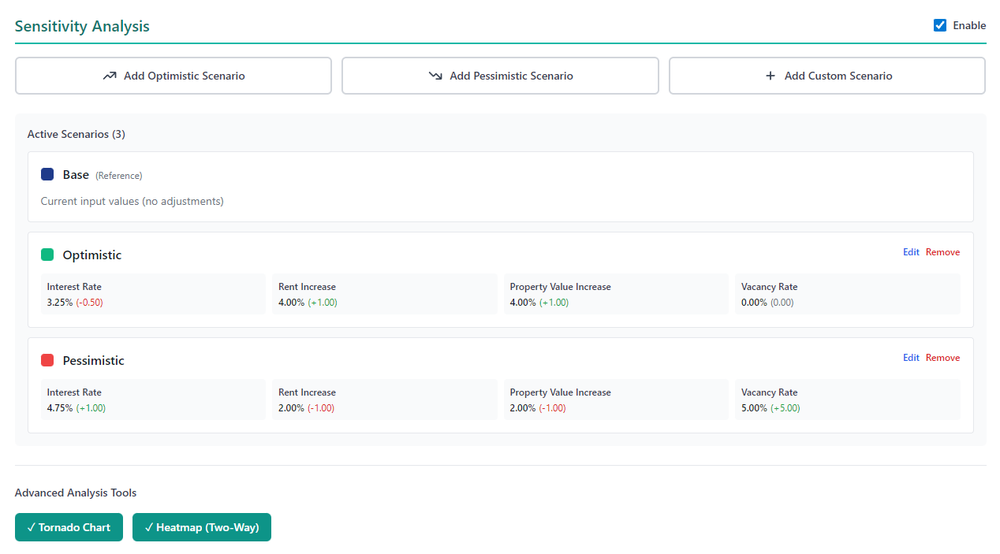
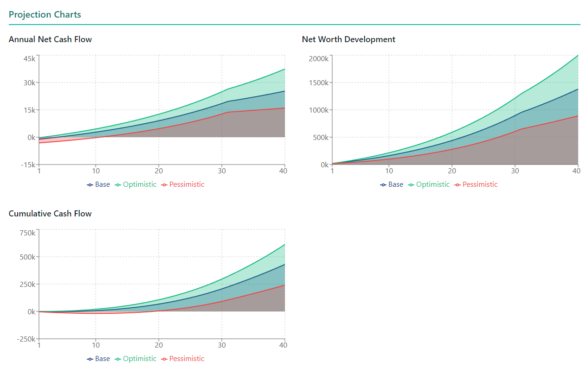
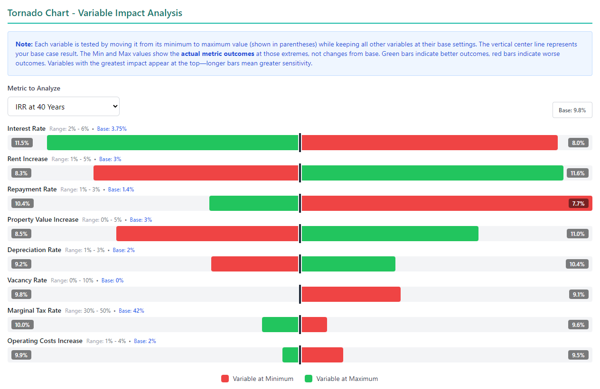
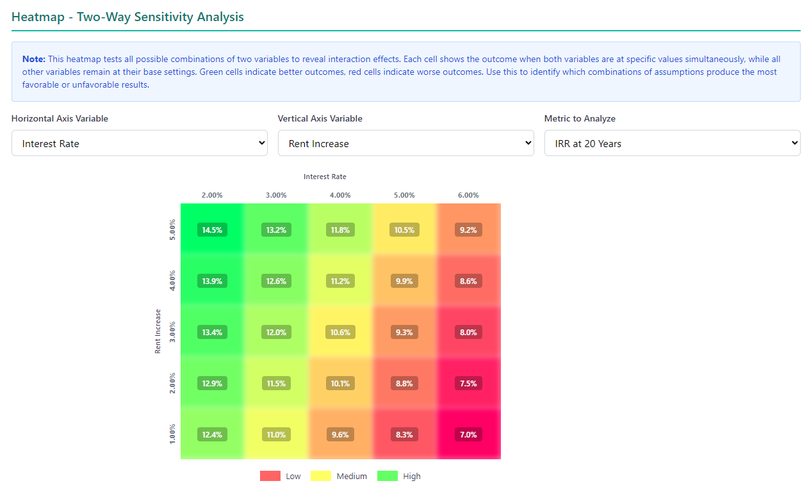

# German Buy-to-Let Property Analyzer

A proof-of-concept React/TypeScript application for analyzing rental property investments in Germany, featuring advanced sensitivity analysis capabilities.

## Project Origin

This application was created in **a single afternoon** using [Anthropic's Claude](https://claude.ai) on the Web via its Artifacts feature. It serves as a **proof of concept** to design and test sophisticated sensitivity analysis features before integrating them into a more comprehensive application used by real estate investment brokers in Germany.

## Purpose

The primary goal was to rapidly prototype and validate three advanced sensitivity analysis approaches:

1. **Tornado Charts** (one-way sensitivity analysis)
2. **Interactive Heatmaps** (two-way sensitivity analysis)
3. **Scenario Presets & Customization** (multi-variable scenarios)

These features allow investors to understand how changes in key assumptions affect investment outcomes over 10, 20, and 40-year time horizons.

### Scenarios (Base / Optimistic / Pessimistic / Custom)

<div align="center">
   
   
</div>

### Tornado Chart

<div align="center">
   
</div>

### Heatmap Chart

<div align="center">
   
</div>

## Technology Stack

- **React 18.3** with TypeScript 5.6
- **Vite 6.0** for build tooling and development
- **Recharts 2.13** for data visualization
- **Tailwind CSS 3.4** for styling

The entire application runs client-side with no backend, making it easy to deploy and share.

## Getting Started

```bash
# Install dependencies
npm install

# Start development server (http://localhost:5173)
npm run dev

# Build for production
npm run build
```

## Core Features

### Financial Modeling

The application provides comprehensive 40-year projections for German rental properties, including:

- **Acquisition costs** (purchase price, notary, transfer tax, broker fees, renovation)
- **Loan financing** with annuity calculations (30-year term)
- **Rental income** with vacancy adjustments and annual rent increases
- **Operating expenses** (management, maintenance, insurance)
- **German tax calculations** including progressive income tax, solidarity surcharge, and optional church tax
- **Depreciation (AfA)** modeling for German real estate (2% standard rate)
- **IRR and ROI calculations** at 10, 20, and 40-year horizons

### Sensitivity Analysis Features

This is the core innovation of the proof of concept.

#### 1. Tornado Charts (One-Way Sensitivity)

Tornado charts visualize the **individual impact** of each variable on investment outcomes:

- Tests 8 key variables independently: interest rate, rent increase, property value appreciation, operating cost increases, vacancy rate, tax rate, repayment rate, and depreciation rate
- Shows both optimistic (green) and pessimistic (red) outcomes for each variable
- Bars are sorted by total impact magnitude, creating the characteristic "tornado" shape
- Helps identify which assumptions matter most to your investment thesis

**Use case:** Quickly identify the 2-3 variables that drive 80% of outcome variance.

#### 2. Interactive Heatmaps (Two-Way Sensitivity)

Heatmaps explore how **two variables interact** across their full range:

- Select any two variables from the sensitivity controls
- Displays a 5×5 grid testing all 25 combinations
- Color gradient visualization: red (low returns) → yellow (medium) → green (high)
- Choose from multiple metrics: IRR at 10/20/40 years, total cash flow, or net worth
- Responsive design with glossy overlay effect for enhanced readability

**Use case:** Understand interaction effects—e.g., how does high rent growth protect against rising interest rates?

#### 3. Scenario Presets & Custom Scenarios

Define and compare multiple complete investment scenarios:

- **Optimistic Preset:** Lower interest rates, higher rent/property appreciation, zero vacancy
- **Pessimistic Preset:** Higher interest rates, lower growth rates, elevated vacancy
- **Custom Scenarios:** Full control over all 8 sensitivity variables
- Visual comparison across all scenarios in projection charts
- Distinct color coding for each scenario (up to 5 concurrent scenarios)
- Save/edit/delete scenario management

**Use case:** Present best-case, base-case, and worst-case projections to stakeholders in a single view.

### German Market Specifics

The calculator implements German real estate investment requirements:

- **German progressive tax system** (14-45% with Grundfreibetrag allowance)
- **Married filing jointly** (Ehegattensplitting) support
- **State-specific transfer taxes** (Grunderwerbsteuer: 3.5-6.5%)
- **Straight-line depreciation** (AfA) at configurable rates
- **Tax benefit modeling** for negative rental income (common in early years)

## Technical Architecture

The application uses a **single-component architecture** (`src/App.tsx`) by design, as it was created for rapid prototyping in Claude's Artifacts environment. The entire application fits in ~2,400 lines of well-organized TypeScript.

Key design patterns:
- React hooks for all state management (`useState`, `useMemo`)
- Aggressive memoization for performance (tornado charts run 17 projections, heatmaps run 25)
- Lazy calculation (sensitivity analysis only computes when panels are expanded)
- Responsive design with Tailwind breakpoints for mobile/tablet/desktop

## Documentation

For implementation details, see:

- [**docs/README.md**](docs/README.md) - Comprehensive architectural documentation
- [**docs/CALCULATIONS.md**](docs/CALCULATIONS.md) - Mathematical formulas for all financial calculations
- [**docs/SENSITIVITY_ANALYSIS_IMPLEMENTATION_GUIDE.md**](docs/SENSITIVITY_ANALYSIS_IMPLEMENTATION_GUIDE.md) - Step-by-step sensitivity analysis implementation
- [**docs/HEATMAP_ARCHITECTURE.md**](docs/HEATMAP_ARCHITECTURE.md) - Table-based heatmap design specification
- [**CLAUDE.md**](CLAUDE.md) - Development guidelines for working with Claude Code

## Validation & Next Steps

This proof of concept successfully validated:

- **Feasibility** of implementing complex sensitivity analysis in a reactive UI
- **Performance** of running 25+ concurrent projections without blocking the UI
- **UX patterns** for tornado charts, heatmaps, and scenario comparison
- **Visual design** for color-coded gradients and responsive layouts

The validated features will now be integrated into the production application used by German real estate investment brokers, with enhancements including:

- Backend integration for data persistence
- PDF export of sensitivity analysis reports
- Monte Carlo simulation for probabilistic scenarios

## License

This project is a proof of concept created for evaluation purposes.

---

**Created with Claude** | [Anthropic](https://anthropic.com) | January 2025
